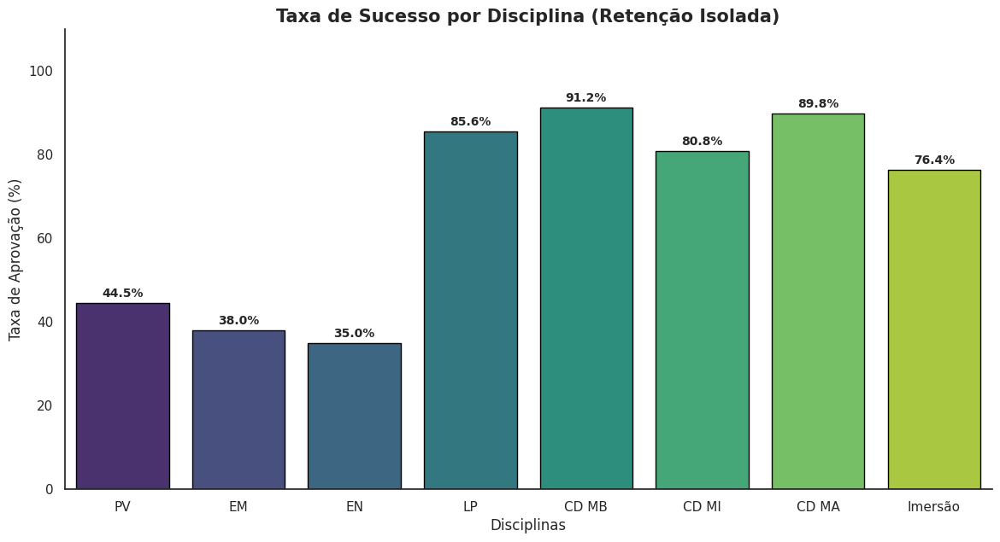
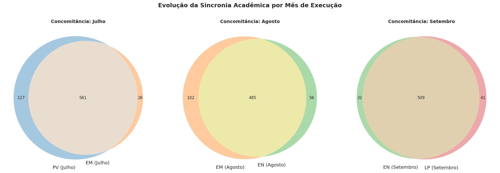
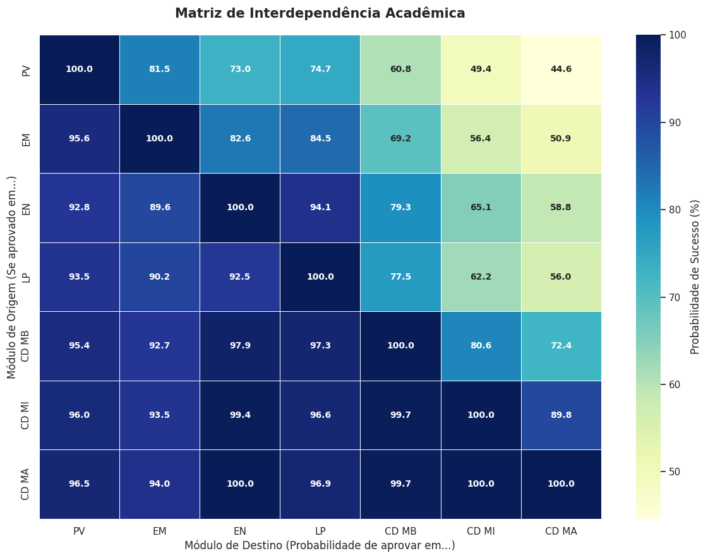
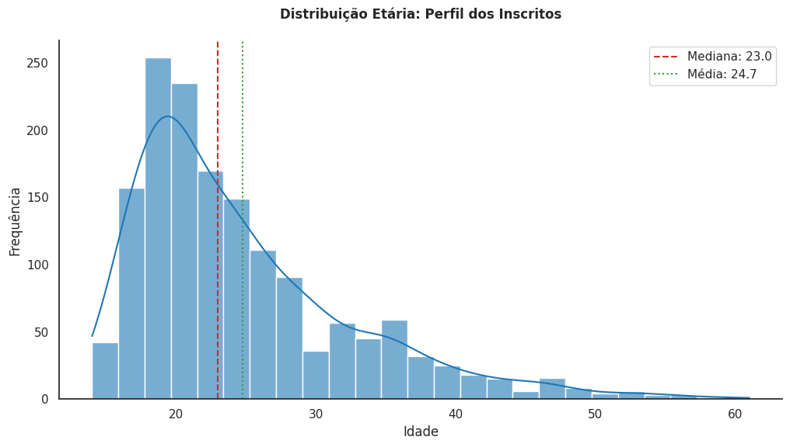
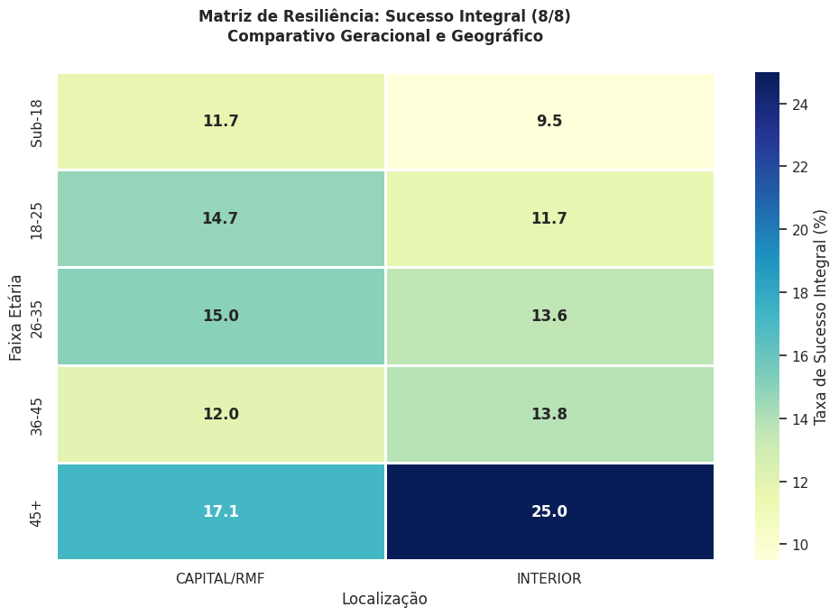

#  Análise de Evasão e Performance em Curso Técnico EAD (Python)


>  **Nota sobre os dados:** este projeto foi desenvolvido com uma base de dados **real e anônima**, cedida por uma instituição parceira para fins educacionais. Por acordo de confidencialidade, a base **não está disponível neste repositório** — o objetivo aqui é apresentar a metodologia e o código da análise.

---

##  Sobre o projeto

Este projeto analisa as tendências e características de evasão e aprovação em um **curso técnico EAD de tecnologia**, com foco na trilha técnica em Tecnologia da Informação. O itinerário formativo é composto por oito módulos — Projeto de Vida (PV), Empreendedorismo (EM), Inglês (EN), Lógica de Programação (LP), e três módulos técnicos progressivos (CD MB, CD MI, CD MA) até a etapa final de Imersão.

A análise foi estruturada em duas fases:
- **Fase 1** — Síntese de performance e tendências (funil de aprovação, gargalos, impacto da recuperação)
- **Fase 2** — Perfil demográfico e cruzamento de dados (idade, gênero, localização geográfica)

##  Tecnologias utilizadas

- **Python** (`pandas`, `numpy`) — carga, limpeza e transformação dos dados
- **Matplotlib / Seaborn** — visualização de dados
- **Jupyter / Google Colab** — ambiente de desenvolvimento

##  Estrutura do repositório

```
analise-evasao-curso-ead/
├── notebooks/
│   └── analise_evasao_curso_ead.ipynb   # notebook completo (código + análises)
├── images/
│   └── *.png                             # gráficos gerados na análise
└── README.md
```

##  Metodologia

1. **Carga e unificação dos dados**: consolidação de três tabelas (dados cadastrais, notas/status e identificadores) via merge pelo ID do aluno.
2. **Limpeza e padronização**: tratamento semântico de valores nulos (ex.: ausência de suspensão tratada como "Não"), correção de outliers de idade por imputação de mediana, e criação da variável derivada `SITUACAO_FINAL` (Concluinte vs. Desistente).
3. **Construção de métricas**: funil de aprovação em cascata por módulo, taxa de eficácia da recuperação (REC), e taxas de sucesso segmentadas.
4. **Análise exploratória (EDA)**: geração de 14 visualizações cobrindo desde performance por disciplina até correlações geográficas e demográficas.
5. **Auditoria de integridade**: rotina de verificação automatizada que audita volume total, cobertura das situações finais e consistência dos dados demográficos.

##  Principais resultados

### Taxa de sucesso por disciplina
As três disciplinas iniciais (PV, EM, EN) — cursadas de forma concomitante — apresentam as menores taxas de aprovação isolada, funcionando como um "filtro natural" no início da jornada, enquanto os módulos técnicos avançados mantêm taxas de sucesso acima de 80%.



### Funil de conversão e sobrevivência acadêmica
O funil mapeia a retenção desde o ingresso (1.545 alunos) até o módulo final de Imersão, evidenciando em quais etapas ocorrem os maiores gargalos.



### Matriz de interdependência entre módulos
Um heatmap de correlação que responde: dado que um aluno foi aprovado no módulo X, qual a probabilidade de sucesso no módulo Y?



### Perfil etário dos inscritos
A maior concentração de inscritos está na faixa dos 20 anos (mediana de 23, média de 24,7), com uma cauda longa até a faixa dos 60 anos.



### Matriz de resiliência: geografia x faixa etária
Nas faixas etárias mais jovens, alunos da capital/região metropolitana têm leve vantagem; a partir dos 36 anos, o cenário se inverte e alunos do interior superam seus pares — sugerindo maior comprometimento do público mais maduro do interior.



*(as demais 9 visualizações — diagramas de Venn de concomitância, tendência de desgaste, eficácia da recuperação, diagrama de Pareto, cruzamento escolaridade × gênero, desempenho por gênero, boxplot de idade, e top 10 cidades em evasão — estão disponíveis na pasta [`images/`](images/) e no notebook completo)*

##  Aprendizados e conclusões

- A concomitância de disciplinas no início do itinerário (PV, EM, EN) concentra o maior volume de evasão, o que indica que reforçar o suporte pedagógico nesse momento inicial tem potencial de maior impacto na retenção geral.
- A maturidade (idade) atua como fator compensatório para barreiras geográficas: alunos mais velhos do interior apresentam maior resiliência que os mais jovens da capital.
- Construir uma rotina automatizada de auditoria de integridade (volume, cobertura de situação final, consistência demográfica) foi essencial para garantir confiabilidade dos números antes de qualquer conclusão analítica.

##  Autor

**Tiago** — [GitHub](https://github.com/TiagoACTR)
